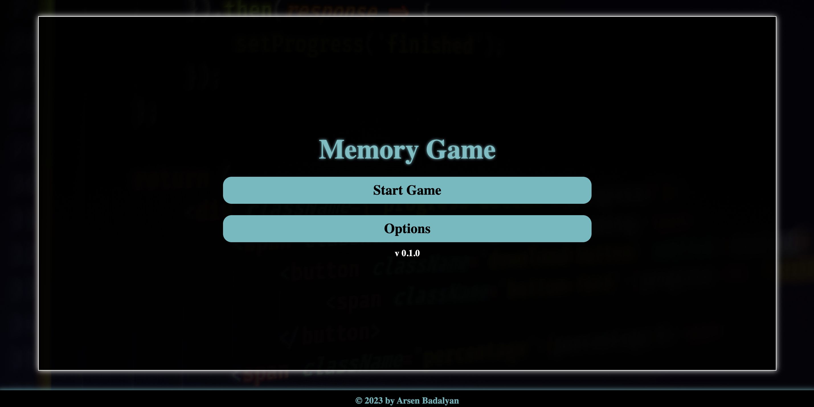

# Memory Game

Welcome to the Memory Game! Test your memory and concentration by matching pairs of cards.

## How to Play

1. Open the game by clicking on cards.
2. Memorize the icons on the cards.
3. Click on two cards at a time to reveal their icons.
4. If the icons match, the cards will stay open. If not, they will close after a moment.
5. Keep opening and matching pairs until all cards are revealed.

## Getting Started

### Prerequisites

- Node.js and npm (Node Package Manager) should be installed on your machine.

### Installation

1. Clone the repository: `git clone https://github.com/arsenbadalyan/memory-game`
2. Navigate to the project directory: `cd memory-game`
3. Install dependencies: `npm install`

### Usage

1. Start the development server: `npm start`
2. Open your web browser and go to `http://localhost:3000` to play the game.

## Technologies Used

- React: JavaScript library for building user interfaces.
- HTML/CSS: For structuring and styling the game.

## Contributing

Contributions are welcome! Please fork the repository and create a pull request with your changes.

## License

This project is licensed under the MIT License - see the [LICENSE](LICENSE) file for details.

## Acknowledgments

- This game was inspired by the classic memory card matching game.
